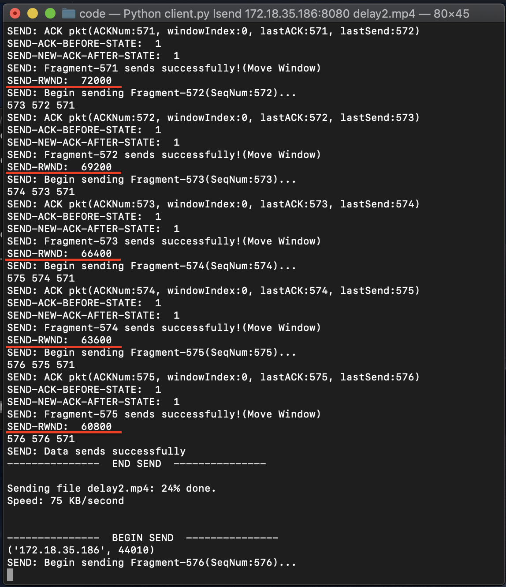
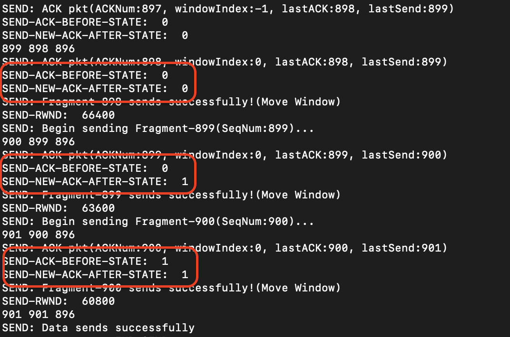

# Test

In the test section, we design tests to verify the ability of LFTP to exchange file between clients and servers and serve multiple clients at the same time. Also, we'll exam the reliability of RDP. Besides, flow control and congestion control of RDP won't be absent in our test.

## LFTP

### Send File to Server

In this test, we try to send a 1.79 GB file and a 3 bytes file to check whether LFTP clients could send both large files and small files.

### Get File from Server

### Multiple Users

## RDP

### Reliability

### Flow Control

Flow control changes the sending rate according to the receive window size in the receiver side. In the test, we deliberately set receive side application retrieves data smaller to let data buffered in the buffer and results in the change of the rwnd. We log out the rwnd received in the sender side to see whether the rwnd changed. Obviously, the rwnd changed, which means flow control works!

### Congestion Control

Congestion Control is turing the state of sender's among slow start, congestion avoidance and fast recovery. In our application, we design these three states into three numbers, 0, 1, 2 representing slow start, congestion avoidance and fast recovery in order.

We log out the sender information in the terminal to see whether the congestion control state changed. As we can see, the state at the beginning is 0, slow start and then it changed into 1, congestion avoidance state. This shows the success of the implementation of congestion control in our application.

Also, it works to control the send rate while using.

