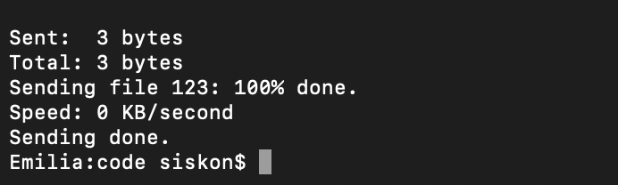
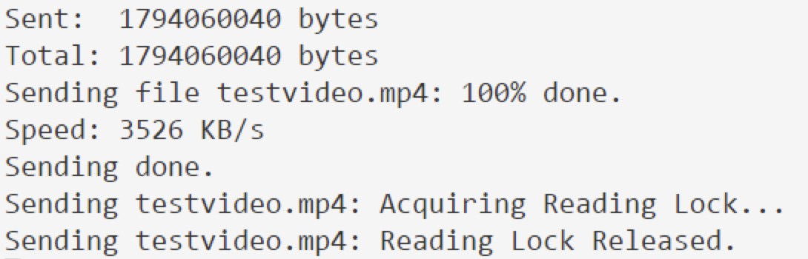

# Test

In the test section, we design tests to verify the ability of LFTP to exchange file between clients and servers and serve multiple clients at the same time. Also, we'll exam the reliability of RDP. Besides, flow control and congestion control of RDP won't be absent in our test.

## LFTP

### Test Environment

- Client: Deployed at Macbook Pro 13' 2017 with MacOS Mojave connected with the SYSU-Secure WiFi in the east public classroom B104
- Server: Deployed at an i7-4250hq based server with Windows 10 1903 connected with the LAN in Zhishanyuan Dormitory 705

### Send File to Server

In this test, we try to send a 1.79 GB file and a 3 bytes file to check whether LFTP clients could send both large files and small files.

- 1.79 GB file, client side log

    

- 1.79 GB file, server side log

    

As you can see, the large file is successfully sent from the client to the server at the speed of about 2.6 MB/s. During sending, we met several timeout issues. But our protocol is strong enough to handle these condition and deliver the file safely to the server. (We can also open it at the server side!)

Along with supporting the transporting of large files, small files are also supported by our application:

- 3 bytes file, client side log

    

- 3 bytes file, server side log

    

Like what happened to the 1.79GB video, the 3 bytes file is safely delivered to the server. (The content string '123' stays unchanged!)

### Get File from Server

Besides sending files, getting files is well supported by our program. We use the files we sent earlier to test this function:

- 1.79 GB file, client side log

    

- 1.79 GB file, server side log

    

- 3 bytes file, client side log

    

- 3 bytes file, server side log

    

As we post above, the server send the file to our client at a higher speed (about 3.5 MB/s). Also, the content of files is transported perfectly without being damaged.

### Local Maximum Speed

A great question is that how fast can our program be when the network environment is perfect. So we test this program at local network (loopback adapter, tested on Macbook Pro). The result is incredible:

- Speed test, server side log:

  

- Speed test, client side log:

  

The file is sent at the speed of 55 MB/s, which can milking a LAN of about 500 Mbps dry. That means our program can be applied to many types of high-performance network and makes it work at its best speed.

### Multiple Users

To test the ability of our software to support multiple users' requests at the same time, we create two clients and make them get files at the same time:

The requests are handles properly and the transfer speed is extremely high.

## RDP

### Flow Control

Flow control changes the sending rate according to the receive window size in the receiver side. In the test, we deliberately set receive side application retrieves data smaller to let data buffered in the buffer and results in the change of the rwnd. We log out the rwnd received in the sender side to see whether the rwnd changed. Obviously, the rwnd changed, which means flow control works!

### Congestion Control

Congestion Control is turing the state of sender's among slow start, congestion avoidance and fast recovery. In our application, we design these three states into three numbers, 0, 1, 2 representing slow start, congestion avoidance and fast recovery in order.

We log out the sender information in the terminal to see whether the congestion control state changed. As we can see, the state at the beginning is 0, slow start and then it changed into 1, congestion avoidance state. This shows the success of the implementation of congestion control in our application.

Also, it works to control the send rate while using.

